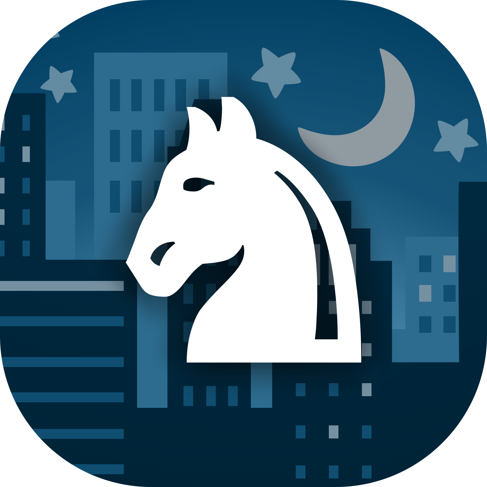

# Game Knight

#### [Figma Demo](https://www.figma.com/proto/K79ySLuqGCEd21DjGE6WXa/Game-Night-Mobile---Color?node-id=2%3A3&scaling=scale-down&page-id=0%3A1&starting-point-node-id=2%3A3)

## To Do

#### 🔴 High Priority
- [ ] add HomeActivity
    - [ ] create card layout for Home
- [ ] add AddGameNightActivity
- [ ] add GameNightActivity
- [ ] add GameNightsActivity
- [ ] implement barcode scanner
- [ ] mark games as borrowable

#### 🟠 Medium Priority
- [ ] remove games from library
    - [ ] using overflow (3 dots) menu in GameView
    - [ ] tap and hold card for options in GameLibrary
- [ ] view other users' borrowable games

#### 🟡 Low Priority
- [ ] disable Game Rules button in GameView if no URL found
- [ ] tap image in GameView to show in full screen
- [ ] use APIs instead of local data

#### 🟢 Completed
- [X] add GameLibraryActivity
- [X] add GameViewActivity
- [X] add SettingsActivity

#### ⚫️ Backlog
- [ ] make SettingsActivity functional
